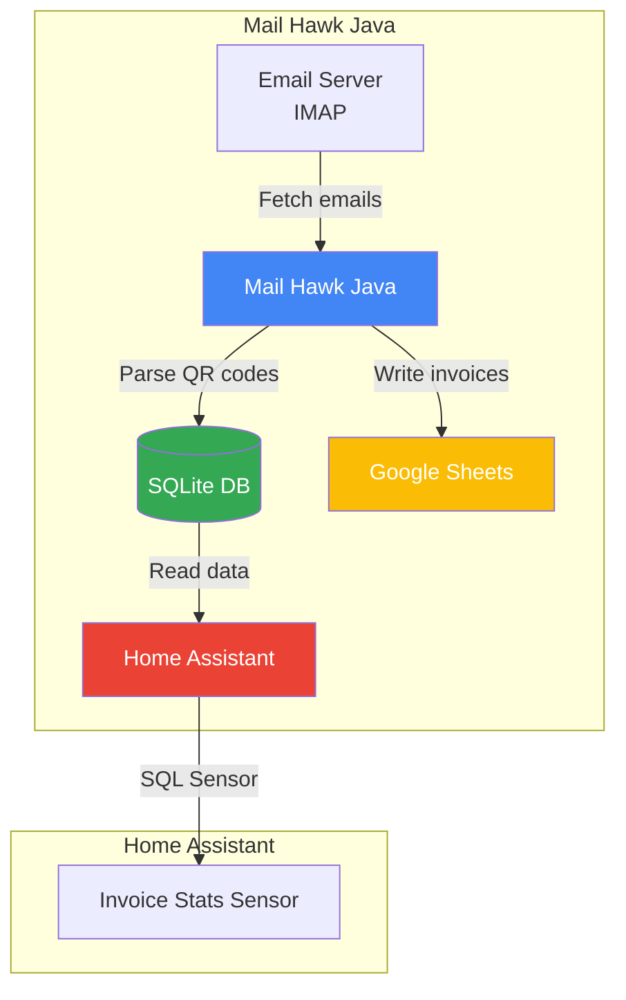

# Mail Hawk

<p align="center">
  
</p>

Monitor email for invoice attachments, parse QR codes and store data in Google Sheets + Home Assistant.

**Java 21 + Quarkus Implementation** - Optimized for performance and memory efficiency.

## Architecture



## Features

- **Email Monitoring**: Monitors email via IMAP for invoice attachments
- **QR Code Parsing**: Parses QR codes from PDF and image files (Portuguese ATCUD format)
- **Google Sheets Integration**: Stores invoice data in Google Spreadsheet
- **SQLite Database**: Local database for tracking processed invoices
- **Home Assistant Integration**: SQL sensor for dashboard + add-on support
- **Performance Optimized**: Low memory footprint with Quarkus native compilation support
- **Modern Java**: Uses Java 21 features (records, pattern matching)

## Tech Stack

- **Java 21** - Latest LTS with modern features
- **Quarkus 3.19.x** - Supersonic subatomic Java framework
- **Lombok** - Reduce boilerplate code
- **Jakarta Mail** - IMAP email client
- **ZXing** - QR code processing
- **Apache PDFBox** - PDF rendering
- **Google Sheets API** - Spreadsheet integration
- **SQLite** - Local database

## Quick Start

### Prerequisites

- Java 21+ ( JDK 21 or higher)
- Docker (for containerized deployment)

### Build

```bash
# Using Maven wrapper
./mvnw clean package

# Run tests
./mvnw test

# Run in development mode
./mvnw quarkus:dev
```

### Run Locally

```bash
# Set environment variables
export MAIL_IMAP_USERNAME="your-email@gmail.com"
export MAIL_IMAP_PASSWORD="your-app-password"
export SPREADSHEET_ID="your-spreadsheet-id"
export GOOGLE_AUTH_ENCODED="base64-encoded-credentials"

# Run with Maven wrapper
./mvnw quarkus:dev

# Or run the JAR directly
java -XX:+UseContainerSupport -XX:MaxRAMPercentage=75.0 \
     -XX:+UseStringDeduplication -XX:+UseCompressedOops \
     -jar target/quarkus-app/quarkus-run.jar
```

## Makefile Commands

```bash
make help              # Show all available commands

# Development
make install           # Install dependencies and check prerequisites
make build             # Build the project
make run               # Run in development mode
make test              # Run tests
make clean             # Clean build artifacts

# Docker
make docker-build      # Build Docker image
make docker-up         # Run Docker container
make docker-logs       # View Docker logs
make docker-down       # Stop Docker container
make docker-clean      # Remove Docker image and containers

# Home Assistant Add-on
make addon-build       # Build add-on image
make addon-run         # Build and run add-on
make addon-logs        # View add-on logs

# Testing with Home Assistant
make ha-up             # Start Home Assistant
make ha-logs           # View HA logs
make ha-down           # Stop Home Assistant
make ha-clean          # Clean HA data
```

## Configuration

### Environment Variables

| Variable | Description | Default |
|----------|-------------|---------|
| `MAIL_IMAP_HOST` | IMAP server host | `imap.gmail.com` |
| `MAIL_IMAP_PORT` | IMAP server port | `993` |
| `MAIL_IMAP_USERNAME` | Email username | - |
| `MAIL_IMAP_PASSWORD` | Email password or app password | - |
| `MAIL_IMAP_FOLDER` | Folder to watch | `INBOX` |
| `MAIL_IMAP_DAYS_OLDER` | Days to look back | `30` |
| `MAIL_LISTENER_SUBJECT_FILTER` | Subject regex filter | `(?i)(.*)(fatura\|factura\|extracto\|recibo)(.*)` |
| `MAIL_LISTENER_ONLY_ATTACHMENTS` | Only process emails with attachments | `true` |
| `MAIL_LISTENER_MAX_EMAILS` | Max emails per check (0 = unlimited) | `0` |
| `SPREADSHEET_ID` | Google Sheets ID | - |
| `SPREADSHEET_SHEET` | Sheet name | `Bills values` |
| `SPREADSHEET_SHEET_DB` | Config sheet name | `config` |
| `GOOGLE_AUTH_ENCODED` | Base64 encoded service account | - |
| `INVOICE_TYPE_DEFAULT` | Default invoice type | `other` |
| `DB_PATH` | SQLite database path | `/share/mail_hawk_java/mail_hawk.db` |
| `CHECK_INTERVAL_SECONDS` | Check interval in seconds | `60` |
| `PDF_PASSWORDS` | Comma-separated PDF passwords | - |

## Home Assistant Add-on

### Installation

1. Add this repository to your Home Assistant supervisor
2. Install the "Mail Hawk Java" add-on
3. Configure via the add-on UI
4. Start the add-on

### Configuration via UI

| Option | Description |
|--------|-------------|
| `mail_imap_host` | IMAP server |
| `mail_imap_username` | Email address |
| `mail_imap_password` | App password |
| `spreadsheet_id` | Google Sheets ID |
| `google_auth_encoded` | Base64 credentials |

### Docker

```bash
# Build
docker build -t mail-hawk-java .

# Run with environment
docker run -d \
  -e MAIL_IMAP_USERNAME="email@gmail.com" \
  -e MAIL_IMAP_PASSWORD="app-password" \
  -e SPREADSHEET_ID="sheet-id" \
  -e GOOGLE_AUTH_ENCODED="base64-creds" \
  -v mail-hawk-data:/share/mail_hawk_java \
  mail-hawk-java
```

## Google Sheets Setup

1. Create a Google Cloud Project
2. Enable the Google Sheets API
3. Create service account credentials
4. Share your spreadsheet with the service account email (as Editor)
5. Base64 encode the credentials:

```bash
base64 -w0 credentials.json
```

Set the result as `GOOGLE_AUTH_ENCODED`.

### Spreadsheet Columns

| Column | Field |
|--------|-------|
| A | Type |
| B | To email |
| C | From email |
| D | Entity |
| E | Invoice Id |
| F | Issuer NIF |
| G | Customer NIF |
| H | Invoice Date |
| I | Invoice Total |
| J | Country |
| K | Invoice type |
| L | Total non taxable |
| M | Stamp duty |
| N | Total Taxes |
| O | Withholding tax |
| P | ATCUD |
| Q | Taxable type |
| R | Tax country region |
| S | Taxable basis exempt of VAT |
| T | Taxable basis of VAT at the reduced rate |
| U | Total VAT at the reduced rate |
| V | Taxable basis of VAT at the intermediate rate |
| W | Total VAT at the intermediate rate |
| X | Taxable basis of VAT at the standard rate |
| Y | Total VAT at the standard rate |
| Z | Hash |
| AA | Certificate number |
| AB | Invoice date (Month) |
| AC | Invoice date (Year) |
| AD | Raw |
| AE | Invoice filename |
| AF | Email Id |
| AG | Email received date |
| AH | Email subject |
| AI | Processed at |

## Project Structure

```
mail-hawk-java/
├── pom.xml                    # Maven build config
├── Makefile                   # Build commands
├── Dockerfile                 # Docker image
├── config.yaml               # HA add-on config
├── run.sh                    # HA startup script
├── repository.yaml           # HA repository config
├── src/main/
│   ├── java/com/amfalmeida/mailhawk/
│   │   ├── MailHawkApplication.java
│   │   ├── config/           # Configuration interfaces
│   │   ├── model/            # Data models
│   │   └── service/          # Business services
│   └── resources/
│       └── application.properties
└── .mvn/wrapper/              # Maven wrapper
```

## Performance

- **Low Memory**: Quarkus optimizes for containers with `-XX:MaxRAMPercentage=75.0`
- **Fast Startup**: Quarkus provides fast startup times
- **Efficient Scheduling**: Quarkus scheduler for periodic tasks
- **Native Image Ready**: Can compile to native with GraalVM

## License

MIT