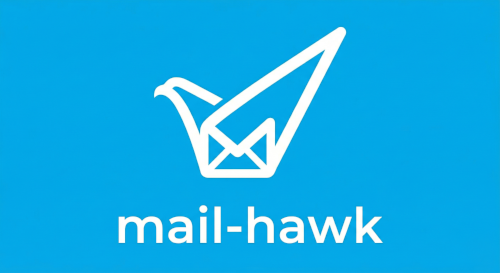

# Mail Hawk

<p align="center">
  
</p>

Monitor email for invoice attachments, parse QR codes and store data in Google Sheets + Actual Budget.

**Java 21 + Quarkus Implementation** - Optimized for performance and memory efficiency.

## Features

- **Email Monitoring**: Monitors email via IMAP for invoice attachments
- **QR Code Parsing**: Parses QR codes from PDF and image files (Portuguese ATCUD format)
- **Google Sheets Integration**: Stores invoice data in Google Spreadsheet
- **Actual Budget Integration**: Automatically imports transactions to Actual Budget
- **SQLite Database**: Local database for tracking processed invoices
- **Home Assistant Integration**: SQL sensor for dashboard + add-on support
- **Performance Optimized**: Low memory footprint with Quarkus native compilation support
- **Modern Java**: Uses Java 21 features (records, pattern matching)

## Tech Stack

- **Java 21** - Latest LTS with modern features
- **Quarkus 3.19.x** - Supersonic subatomic Java framework
- **Lombok** - Reduce boilerplate code
- **Jakarta Mail** - IMAP email client
- **ZXing** - QR code processing
- **Apache PDFBox** - PDF rendering
- **Google Sheets API** - Spreadsheet integration
- **Actual Budget HTTP API** - Budget integration
- **SQLite** - Local database

## Quick Start

### Prerequisites

- Java 21+ (JDK 21 or higher)
- Docker (for containerized deployment)

### Build

```bash
# Using Maven wrapper
./mvnw clean package

# Run tests
./mvnw test

# Run in development mode
./mvnw quarkus:dev
```

### Run Locally

```bash
# Set environment variables
export MAIL_HOST="imap.gmail.com"
export MAIL_PORT="993"
export MAIL_USERNAME="your-email@gmail.com"
export MAIL_PASSWORD="your-app-password"
export SHEETS_ID="your-spreadsheet-id"
export SHEETS_ENCODED_CREDENTIALS="base64-encoded-credentials"

# Run with Maven wrapper
./mvnw quarkus:dev
```

## Makefile Commands

```bash
make help              # Show all available commands

# Development
make install           # Install Java dependencies
make build             # Build the project
make run               # Run in development mode
make test              # Run tests
make clean             # Clean build artifacts

# Docker
make docker-build      # Build Docker image
make docker-up         # Run Docker container
make docker-logs       # View Docker logs
make docker-down       # Stop Docker container
make docker-clean      # Remove Docker image and volumes

# Home Assistant Add-on
make addon-build       # Build add-on image
make addon-run         # Build and run add-on
make addon-logs        # View add-on logs

# Setup
make setup             # Create .env from .env.example
```

## Configuration

### Environment Variables

#### Mail Configuration

| Variable | Description | Default |
|----------|-------------|---------|
| `MAIL_HOST` | IMAP server host | `imap.gmail.com` |
| `MAIL_PORT` | IMAP server port | `993` |
| `MAIL_USERNAME` | Email username | - |
| `MAIL_PASSWORD` | Email password or app password | - |
| `MAIL_FOLDER` | Folder to watch | `INBOX` |
| `MAIL_DAYS_OLDER` | Days to look back | `30` |
| `MAIL_SUBJECT_TERMS` | Comma-separated subject search terms | `fatura,factura,extracto,recibo` |
| `MAIL_ONLY_ATTACHMENTS` | Only process emails with attachments | `true` |
| `MAIL_MAX_EMAILS` | Max emails per check (0 = unlimited) | `0` |

#### Google Sheets Configuration

| Variable | Description | Default |
|----------|-------------|---------|
| `SHEETS_ID` | Google Sheets ID | - |
| `SHEETS_SHEET_NAME` | Sheet name | `values` |
| `SHEETS_CONFIG_SHEET` | Config sheet name | `config` |
| `SHEETS_ENCODED_CREDENTIALS` | Base64 encoded service account | - |

#### Actual Budget Configuration

| Variable | Description | Default |
|----------|-------------|---------|
| `ACTUAL_ENABLED` | Enable Actual Budget integration | `false` |
| `ACTUAL_URL` | Actual Budget HTTP API URL | - |
| `ACTUAL_API_KEY` | API key for authentication | - |
| `ACTUAL_BUDGET_SYNC_ID` | Budget sync ID | - |
| `ACTUAL_ACCOUNT_ID` | Account ID for transactions | - |

#### Application Configuration

| Variable | Description | Default |
|----------|-------------|---------|
| `APP_CHECK_INTERVAL` | Email check interval in seconds | `60` |
| `APP_CONFIG_SYNC_INTERVAL` | Config sync interval in seconds | `300` |
| `APP_DEFAULT_INVOICE_TYPE` | Default invoice type | `other` |

### Docker

```bash
# Build
make docker-build

# Run
make docker-up
```

### Full Stack with Docker Compose

The `docker-compose.yml` includes all required services:

1. **mail-hawk** - Invoice processing service (port 8080)
2. **actual-http-api** - Actual Budget HTTP API (port 5007)

```bash
# Start all services
docker-compose up -d

# View logs
docker-compose logs -f mail-hawk

# Stop all services
docker-compose down
```

To also run **Actual Budget** server, add this to your `docker-compose.yml`:

```yaml
services:
  actual-budget:
    image: actualbudget/actual-server:latest
    container_name: actual-budget
    restart: unless-stopped
    ports:
      - "5006:5006"
    volumes:
      - actual-budget-data:/data
    networks:
      - mail-hawk-network
```

**Service URLs:**
- Mail Hawk: http://localhost:8080
- Actual Budget HTTP API: http://localhost:5007
- Actual Budget (if running): http://localhost:5006

## Actual Budget Integration

Mail Hawk can automatically import invoice transactions into [Actual Budget](https://actualbudget.org/).

### Prerequisites

1. **Actual Budget HTTP API** - You need to run the Actual Budget HTTP API alongside your Actual Budget instance. See [ha-actual-http-api](https://github.com/amfalmeida/ha-actual-http-api) for a Home Assistant add-on that provides this API.

2. **API Key** - Generate an API key from the Actual Budget HTTP API settings.

3. **Budget and Account IDs** - Get the sync ID and account ID from your Actual Budget instance.

### How It Works

When invoices are processed:
1. Invoice data is extracted from QR codes
2. Transaction is created with:
   - **Account**: Configured account ID
   - **Date**: Invoice date from QR code
   - **Amount**: Total amount (negative for expenses)
   - **Payee**: Invoice type/entity name
   - **Notes**: Invoice filename
   - **Imported ID**: ATCUD from QR code (for deduplication)
   - **Cleared**: true

### Configuration

```bash
# Enable Actual Budget integration
ACTUAL_ENABLED=true

# HTTP API URL (from ha-actual-http-api or standalone)
ACTUAL_URL=http://your-server:5007

# API key
ACTUAL_API_KEY=your-api-key

# Budget sync ID (from Actual Budget)
ACTUAL_BUDGET_SYNC_ID=your-budget-sync-id

# Account ID for transactions
ACTUAL_ACCOUNT_ID=your-account-id
```

### Related Projects

- [ha-actual-http-api](https://github.com/amfalmeida/ha-actual-http-api) - Home Assistant add-on providing the HTTP API for Actual Budget

## Home Assistant Add-on

### Installation

1. Add this repository to your Home Assistant supervisor
2. Install the "Mail Hawk" add-on
3. Configure via the add-on UI
4. Start the add-on

### Configuration via UI

| Option | Description |
|--------|-------------|
| `mail_imap_host` | IMAP server |
| `mail_imap_username` | Email address |
| `mail_imap_password` | App password |
| `mail_subject_terms` | Comma-separated subject filter terms |
| `spreadsheet_id` | Google Sheets ID |
| `google_auth_encoded` | Base64 credentials |

### Home Assistant SQL Sensor

Create a sensor to query the SQLite database:

```yaml
sensor:
  - name: "Invoices This Month"
    platform: sql
    db_url: "sqlite:////share/mail_hawk/mail_hawk.db"
    query: "SELECT COUNT(*) as count FROM processed_invoices WHERE strftime('%Y-%m', invoice_date) = strftime('%Y-%m', 'now')"
    column: "count"
```

## Google Sheets Setup

1. Create a Google Cloud Project
2. Enable the Google Sheets API
3. Create service account credentials
4. Share your spreadsheet with the service account email (as Editor)
5. Base64 encode the credentials:

```bash
base64 -w0 credentials.json
```

Set the result as `SHEETS_ENCODED_CREDENTIALS`.

### Spreadsheet Columns

| Column | Field |
|--------|-------|
| A | Type |
| B | To email |
| C | From email |
| D | Entity |
| E | Invoice Id |
| F | Issuer NIF |
| G | Customer NIF |
| H | Invoice Date |
| I | Invoice Total |
| J | Country |
| K | Invoice type |
| L | Total non taxable |
| M | Stamp duty |
| N | Total Taxes |
| O | Withholding tax |
| P | ATCUD |
| Q | Taxable type |
| R | Tax country region |
| ... | (additional tax columns) |
| AH | Email subject |
| AI | Processed at |

## Project Structure

```
mail-hawk-java/
├── pom.xml                    # Maven build config
├── Makefile                   # Build commands
├── Dockerfile                 # Docker image
├── docker-compose.yml         # Docker compose
├── config.yaml               # Home Assistant add-on config
├── repository.yaml           # HA repository config
├── run.sh                    # Startup script
├── src/main/java/com/amfalmeida/mailhawk/
│   ├── client/               # REST clients (Actual Budget)
│   ├── config/               # Configuration interfaces
│   ├── dto/                  # Data transfer objects
│   ├── model/                # Data models
│   ├── service/              # Business services
│   │   ├── MailService.java        # IMAP email fetching
│   │   ├── InvoiceProcessor.java   # Invoice processing pipeline
│   │   ├── SheetsService.java      # Google Sheets integration
│   │   ├── DatabaseService.java    # Database operations
│   │   ├── ActualBudgetService.java # Actual Budget integration
│   │   └── QrCodeParser.java       # QR code parsing
│   ├── db/                   # Database entities
│   └── health/               # Health checks
└── src/main/resources/
    └── application.properties
```

## License

MIT